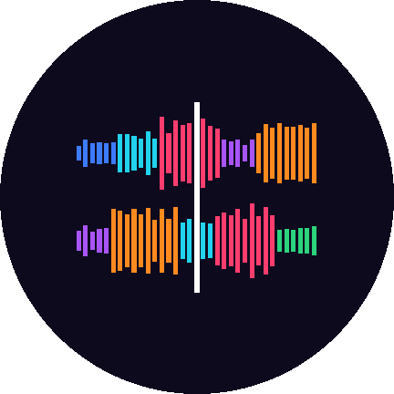

<p align="center">
  
</p>

<h1 align="center">DJ Mantra</h1>

<p align="center">
  <b>A DJ app for Android phones, built on the open-source <a href="https://github.com/mixxxdj/mixxx">Mixxx</a> engine,<br>
  made for the Hercules DJControl Mix Ultra.</b>
</p>

<p align="center">
  <a href="../../releases/tag/android-latest"><b>⬇ Download the test build (APK)</b></a> ·
  <a href="testing/TEST_PLAN.md">Test plan</a> ·
  <a href="docs/ANDROID_PORT.md">How it is built</a> ·
  <a href="https://djmantra.pages.dev">Progress page</a>
</p>

---

DJ Mantra puts a full DJ engine on the phone: two decks with sync, key lock and effects, a
music library that works with USB sticks, and the Hercules DJControl Mix Ultra connected by
cable or Bluetooth. It replaces djay Pro for mixing on the go, with features djay does not
have: songs on USB drives that keep playing when the stick is pulled, folders that stay in
the library while their drive is unplugged, and beat lights on the controller in every pad
mode for lining up phrases.

> **Status: test builds.** Version **0.5.0** is the first one for phones. Every build of
> `main` starts on an Android emulator in CI and must run with sound and reach its main window
> before it becomes the download above. Testing on real phones (Pixel 7) with the Mix Ultra
> starts now; results go to [`testing/results/`](testing/results/).

## Download and install

1. On the phone, open **[Releases → android-latest](../../releases/tag/android-latest)** and
   download `DJMantra-0.5.0-…-phone-arm64.apk` (Pixel 7 and other 64-bit ARM phones).
2. Open the file and allow installing apps from this source.
3. First start (about 10 seconds, once per new version): DJ Mantra installs its skins and
   controller mappings, then asks for **All files access** (to play music from USB drives) and
   **Nearby devices** (to find the Mix Ultra over Bluetooth).

With a computer: `adb install -r DJMantra-0.5.0-…-phone-arm64.apk`. Test builds are signed with
a public test key, so each new one installs over the previous one and keeps the library.

## Features

### Ready in the test builds

| | |
|---|---|
| **Mixxx 2.5.6 engine** | Two decks, sync, key lock, pitch, loops, hot cues, EQs and effects, BPM and key analysis. All 913 desktop tests pass. |
| **Sound on the phone** | Through Oboe (AAudio): the speaker, USB audio or Bluetooth, whatever Android plays to; follows the route when headphones or a speaker are connected. |
| **Hercules DJControl Mix Ultra** | Mapped from a capture of the real controller: every button, SHIFT layer, the pads in all 8 modes, the jog wheels and the LEDs. Connects over **USB-C** or **Bluetooth LE MIDI without pairing in Settings**, reconnects by itself, and keeps the screen on while connected. |
| **Beat lights** | The pads show beat 1–8 of the phrase in every pad mode, so two songs line up "1 with 1"; a slicer pad jumps to its beat, SHIFT + pad 1 sets "1 is here". SHIFT + STEMS turns them off and on. |
| **USB sticks, disks and SD cards** | Opened through Android's folder picker. A song is copied to the phone before it plays, so pulling the stick out does not stop the music, and a re-plugged drive is picked up again. |
| **Folders like in djay** | "+" adds a folder; it and its subfolders become a tree of playlists that stays in the library. Songs on an unplugged drive are marked offline instead of disappearing. |
| **Library** | ★ 1–5 rating (click to raise), an Export column with tick marks, export of the marked songs or of missing songs as a list with links (TIDAL, Bandcamp, Beatport, Qobuz), every column sortable. |
| **Video files as tracks** | MP4, MOV, M4V, MKV, WebM, AVI, FLV and 3GP play their audio; the first frame (or the first non-black one) becomes the cover. |

### Coming next

| | |
|---|---|
| **Touch interface** | Two decks, waveforms, mixer and pads drawn with Qt Quick, plus the **full-screen waveform view** (deck 1 on top, deck 2 below, song titles upper left, beat lights) and a full-screen library view. The test builds show the Mixxx LateNight skin with software-drawn waveforms until then. |
| **Two outputs at once** | Master on a Bluetooth speaker and cue on USB headphones, with a delay setting to keep them in sync. |
| **TIDAL** | Log in, see your playlists in the app, match them to your own files. |
| **Smart genres and overnight analysis** | BPM, beat grid, key, waveform and genre for the whole library in one run; genre folders that fill themselves. |
| **Song sections in color** | Intro, build-up, drop, breakdown, outro, detected on the phone. |

The order and the state of each step are on the [progress page](https://djmantra.pages.dev)
and in [docs/ANDROID_PORT.md](docs/ANDROID_PORT.md).

## How it is checked

Every push runs two workflows:

- **Linux build & tests** ([`linux.yml`](.github/workflows/linux.yml)): the desktop build and the
  whole Mixxx test suite plus DJ Mantra's own tests (external drives, folders, phrase lights,
  the MIDI stream parser, resource install and more).
- **Android** ([`android.yml`](.github/workflows/android.yml)): APKs for phones (arm64-v8a) and
  the emulator (x86_64). The build fails if a native library the app needs is missing, if the
  name, icon, skins or Mix Ultra mapping are not in the APK, or if the **launch test** on an
  Android emulator does not see the app start, open its sound output, run the audio engine and
  reach its main window without a crash or critical error. A crash there is printed with
  function names (`ndk-stack`, unstripped libraries in the `djmantra-<abi>-symbols` artifact).

On `main`, a build that passes everything replaces the
[android-latest](../../releases/tag/android-latest) download.

Phone tests follow [`testing/TEST_PLAN.md`](testing/TEST_PLAN.md) (`/test-on-phone` in Claude
Code on the computer the phone is plugged into); every app message is in logcat under the tags
`DJMantra` and `DJMantraMIDI`.

## Building

**Desktop (Linux)**, the baseline for the engine and the tests:

```bash
tools/debian_buildenv.sh setup     # Ubuntu/Debian build dependencies
cmake -S . -B build -G Ninja -DQT6=ON -DQML=ON
cmake --build build
(cd build && QT_QPA_PLATFORM=offscreen ctest)
```

**Android**: CI builds the APKs (see `android.yml` for the exact steps). Locally you need
Qt 6.8.3 for Android (with `qtshadertools` and `qt5compat`) and its desktop host tools, NDK r27,
and the dependencies from `packaging/android/vcpkg.json` built with vcpkg for `arm64-android`
or `x64-android`; then configure with Qt's `qt.toolchain.cmake` and build the `apk` target.

## Project layout

| Path | What |
|---|---|
| `src/` | Mixxx 2.5.6 plus DJ Mantra's additions (`soundio/sounddeviceoboe.*`, `controllers/midi/androidmidicontroller.*`, `library/folders/`, `sources/localtrackcache.*`, `sources/externalcontent.*`, `engine/controls/phrasecontrol.*`, …) |
| `packaging/android/` | Manifest, icon, Java helpers (folder picker, MIDI), vcpkg manifest and triplets |
| `res/controllers/Hercules DJControl Mix Ultra.*` | The controller mapping (generated by `tools/controller/gen_mix_ultra_xml.py`) and its script |
| `docs/` | Port plan and status, controller research, djay beat-grid research |
| `testing/` | Test plan and the results of every phone test |
| `tools/android/` | APK library check, package staging, launch test, icon generator |

## License

DJ Mantra is a fork of Mixxx and is licensed under the **GNU GPL v2 or later**, the same as
Mixxx. See [LICENSE](LICENSE) and [COPYING](COPYING). The source of every build is public.

The upstream base is Mixxx **2.5.6** (`94ccc34f91d37dec62d0d70c16fac38dc8af677f`); the original
Mixxx README is in [README.mixxx.md](README.mixxx.md). "Hercules" and "DJControl" are trademarks
of Guillemot Corporation; DJ Mantra is not affiliated with Hercules or with Algoriddim (djay).
