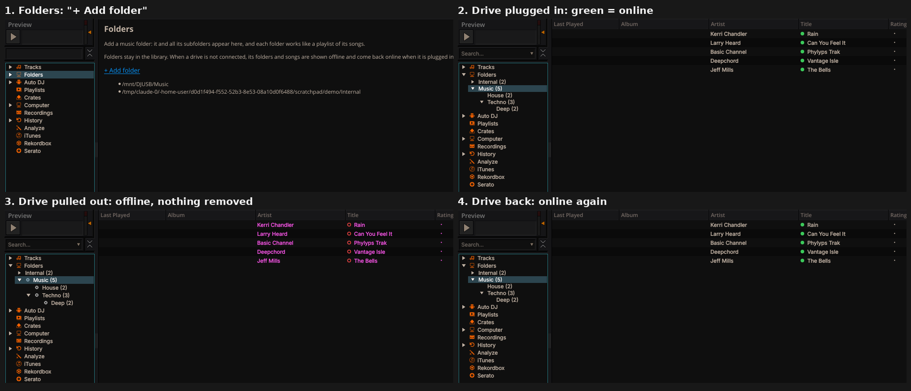

# Android port roadmap

DJ Mantra ports the Mixxx 2.5.6 engine to Android. This file tracks the plan and its status.

Upstream Mixxx has no Android support. It does have an experimental iOS target, a Qt 6
build, and an experimental QML UI (`res/qml`, `src/qml`), and the port builds on all three.

## Target

| | |
|---|---|
| Android | 10+ (API 29). That is what the Mix Ultra requires, and the NDK MIDI API needs it too. |
| ABI | `arm64-v8a` (phones); `x86_64` for the CI emulator |
| Qt | Qt 6 for Android |
| Audio | Oboe/AAudio |
| MIDI | Android MIDI (`android.media.midi`, NDK `AMidi`), USB and Bluetooth LE |
| UI | QML, touch-first layout |

## What has to change

### 1. Audio: `SoundDeviceOboe` (new)
PortAudio, which Mixxx uses on desktop and iOS, has no Android backend. So we add
`src/soundio/sounddeviceoboe.{h,cpp}`, a `SoundDevice` subclass built on Oboe, next to
`SoundDevicePortAudio`.

- Enumerate output devices (speaker, wired, USB, Bluetooth A2DP) through `AudioManager.getDevices()`,
  called over JNI.
- Open one Oboe stream per device with `setDeviceId()`, so **master and cue can go to two
  devices at once**, for example a Bluetooth speaker and USB headphones.
- `SoundManager` already handles several devices, with one clock device and the others kept
  in sync, and it has per-output delay (Main / Headphone / Booth delay). That delay is
  how Bluetooth latency gets compensated. We also add a measured-latency hint from
  `AudioTrack`/AAudio timestamps.
- Use multichannel streams for 4-output USB interfaces (master 1/2, cue 3/4).

### 2. MIDI: `AndroidMidiController` (new)
PortMidi has no Android backend.

- Java side, `packaging/android/src/.../MidiBridge.java`:
  - `MidiManager` device discovery.
  - BLE scan for the MIDI service `03B80E5A-EDE8-4B33-A751-6CE34EC4C700`.
  - `openBluetoothDevice()`.
  - Runtime permissions: `BLUETOOTH_SCAN`, `BLUETOOTH_CONNECT`.
- C++ side, `src/controllers/midi/androidmidicontroller.{h,cpp}` and an enumerator.
  It uses `AMidiDevice_fromJava`, `AMidiOutputPort` and `AMidiInputPort`, and feeds the existing
  `MidiController` so **all existing mappings, scripting and MIDI learn work unchanged**.

### 3. Build and packaging
- CMake: an `ANDROID` branch next to the existing `IOS` one. `qt_add_executable` (which
  produces a shared library for Android), `QT_ANDROID_PACKAGE_SOURCE_DIR=packaging/android`,
  and `res/` bundled as assets.
- Off on Android: PortAudio, PortMidi, HID, BULK/libusb, broadcast (shout), LV2 (lilv),
  keychain, X11, DBus, UPower, HSS1394.
- Dependencies for `arm64-android`:
  - Qt via `aqtinstall`.
  - Through vcpkg: Oboe, rubberband, soundtouch, taglib, chromaprint, fftw3, libebur128,
    libkeyfinder, flac, ogg, vorbis, opus, opusfile, sndfile, mp3lame, libmad, libid3tag,
    protobuf, ms-gsl.
  - Note: AAC/M4A decoding comes later, through FFmpeg or NDK `AMediaCodec`.
- CI (GitHub Actions): build the APK, then run on an API 34 `pixel_7` emulator.
- Done (after phone test run #31):
  - `tools/android/stage_android_package.cmake` assembles the package source dir in the build
    tree: `packaging/android/package` (own `AndroidManifest.xml` from Qt 6.8.3's template with
    the label **DJ Mantra** and the icon, Java helpers) plus `assets/res` (skins, controllers,
    effects, fonts, keyboard, qml, translations `*.qm`; about 45 MB, 2800 files) with an index
    and a per-build stamp.
  - At start, `computeResourcePathImpl()` has a `Q_OS_ANDROID` branch (Android also defines
    `__UNIX__`, so it used to look for `../share/mixxx` and found nothing):
    `BundledResources::install()` copies `assets:/res` to `files/res` once per build.
  - The name: `VersionStore::applicationName()` is "DJ Mantra" on Android (titles, About box);
    `versionName` 0.5.0 (`DJMANTRA_VERSION`), the About box adds "(Mixxx 2.5.6 engine)".
    `version()` and the `.mixxx` settings folder stay as they are, because the settings upgrade
    and existing installs depend on them.
  - Icon: `tools/android/gen_launcher_icon.py` writes an adaptive vector icon (two waveforms
    colored by section, white playhead); preview `docs/djmantra-icon.png`.
  - Startup no longer runs inside `QOpenGLWindow::resizeEvent()` on Android (queued), and all
    Qt messages also go to logcat (tag `DJMantra`).
  - CI checks the label, icon and `assets/res` in every APK, keeps the unstripped library
    (artifact `djmantra-<abi>-symbols`) and starts the x86_64 APK on an emulator
    (`tools/android/smoke_test.sh`): a crash, a critical error or no main window fails the run.

### 4. Touch UI (`res/qml/djmantra/`)
This uses the familiar mobile DJ layout, but it is our own design and does not copy
Algoriddim's djay artwork or branding.

- Landscape: two decks with platters and waveforms across the top, the mixer (EQ, filter,
  gain, crossfader) in the centre, and pads below.
- Library browser with search, using Android's storage access for music files.
- Settings: audio routing per output, with delay; controllers, with mapping picker and MIDI learn.

### 5. Hercules DJControl Mix Ultra
- Capture the controller's MIDI messages over BLE on a real phone. Use those to write a
  `Hercules DJControl Mix Ultra.midi.xml` and its script.
- Expose Mixxx's existing MIDI learn in the QML UI, so any control can be remapped.

### 5b. Mix Ultra mapping and beat lights (written from the capture)
- `res/controllers/Hercules DJControl Mix Ultra.midi.xml` (generated by
  `tools/controller/gen_mix_ultra_xml.py`) + `Hercules-DJControl-Mix-Ultra-script.js`.
- One SHIFT per deck (91/92 04), 14-bit knobs and faders, GAIN on SHIFT+HIGH (B4/B5 04),
  jog touch 08 / top 0A / ring 09 (±1 per tick, 240 per turn), mode buttons 0F–12 and 13–16,
  pads `96`/`97` base + pad (+8 with SHIFT), LOAD 0D, PFL 0C, browser B0 01 / 90 00,
  STEMS 90 01, master B0 03, crossfader B0 00, init B0 7F 7F.
- **Beat lights (default on, like djay's slicer):** in every pad mode the pads show the beat
  in the 8-beat phrase. SLICER pads jump to that beat (keeping the phase), SHIFT + SLICER
  pad 1 sets "1 here"; SHIFT + STEMS turns the lights off.
- Engine: `PhraseControl` (`src/engine/controls/phrasecontrol.cpp`): `beat_in_phrase`,
  `phrase_length` (4/8/16/32), `phrase_anchor` (default: the main cue's beat, else the grid's
  first beat), `phrase_set_one`, `phrase_jump`. Counted on the beat grid (beat maps work).
  Research: `docs/research/djay-beatgrid-slicer.md`.
- TODO (next local test): deck 1 SHIFT + jog, pad LED notes/colours per mode, tempo fader
  direction, saving "1" per track.

### 6. Video files (audio track + video frame as cover art)
- Playback uses Mixxx's FFmpeg decoder (`SoundSourceFFmpeg`), which picks the best audio
  stream of any container. Added MKV/MKA/WebM/AVI/FLV to its formats; MP4/MOV/M4V/3GP were
  already there. Matroska often lacks per-stream durations, so the container duration is
  used as a fallback.
- Cover art: `src/sources/videocoverimage.cpp` (FFmpeg + swscale). It uses an attached cover
  picture if there is one. Otherwise it uses the first video frame that isn't black, scaled
  to at most 1024 px. It is hooked into `SoundSourceProxy::importTrackMetadataAndCoverImage`,
  so it works whichever decoder plays the file, and only runs when the file has no cover tag.
- Title/artist come from tags if TagLib can read them (MP4/MOV), otherwise from the file name
  ("Artist - Title.mkv").
- Known limit: after seeking in **MKV** files, playback may resume up to about 1 ms off
  because Matroska timestamps have millisecond resolution. That is inaudible. MP4 and WebM
  seek sample-exactly (covered by the seek tests).
- Tests: `src/test/videocoverimage_test.cpp`, and MP4/WebM added to `SoundSourceProxyTest`.
- Android: FFmpeg is now enabled (vcpkg `ffmpeg[avcodec,avformat,swresample,swscale]`). It
  also decodes MP4/AAC audio, since FAAD is not used on Android.

### 7. External drives (USB sticks, USB disks, SD cards)
- **Local copies** (`src/sources/localtrackcache.cpp`): a song on an external drive is copied
  to internal storage when a deck loads it, and the deck, the analyzer and fingerprinting read
  only the copy. Pulling the drive out, a loose OTG cable or a sleeping disk cannot interrupt
  playback. If the drive drops out while the copy is being made, the copy waits up to 30 s
  for it to come back and continues where it stopped. Copies are reused while the original is
  unchanged (size + modification time) or unreachable; least recently used copies are deleted
  above the limit (8 GB, and 300 MB of storage is always left free). Files larger than the
  limit play from the drive.
- **Library**: a scan never marks tracks as missing, or relocates them, while their drive (or
  library folder) is unplugged; they are just kept (`LibraryScanner::cleanUpScan`).
- **Drive watcher** (`src/util/volumewatcher.cpp`, `src/library/externaldrives.cpp`): polls
  for drives every 2 s. A returning drive with library folders triggers a rescan 3 s later; a
  new drive is offered for the library once ("Not this drive" is remembered).
- **Android**: drives are `/storage/<volume id>/` (stable across replugs). Reading them with
  file paths needs "All files access" (`MANAGE_EXTERNAL_STORAGE`); the app asks at startup.
- Settings in `mixxx.cfg`, group `[DJMantra]`: `LocalCacheMode` (0 off, 1 external drives,
  2 all files), `LocalCacheMaxMB`, `LocalCacheDir`, `AskToAddDrives`, `IgnoredDrives`.
- Tests: `src/test/localtrackcache_test.cpp` (copy, reuse, stale copies, unplugged drive,
  waiting for a drive, eviction, decoding from the copy, scanner keeps tracks) and
  `src/test/externaldriveplayback_test.cpp` (a deck keeps playing when the file becomes
  unreadable; without the cache the same test goes silent).
- Not yet: copying ahead (next track in Auto DJ or playlist) in the background, and a
  progress indicator while a large video is copied.

### 8. Folders (like djay): folders as playlists, online/offline

- Sidebar **Folders** (`src/library/folders/`): "+ Add folder" (also Library menu → Add Music
  Folder…, and right-click) adds a folder to the library and scans it. The folder and all its
  subfolders appear as a tree with song counts; clicking a folder lists the songs in it and
  all its subfolders, like a playlist that fills itself (any column sortable; default: by file).
- The tree is built from the library database, not the disk: a folder stays until it is
  removed explicitly (right-click → Remove from library…). On an unplugged drive its folders
  get an offline icon and its songs a red hollow dot, the "missing" text color and a tooltip
  ("Offline: its drive is not connected …", and "A copy is on this device" when the local
  copy can still be played). Online songs have a green dot. The marks update when a drive is
  plugged in or out (drive watcher) and after every scan.
- Scanner race fixed (upstream Mixxx bug): when all scan tasks finished before the scanner
  released its own task count, the scan was finished before the tasks' queued results were
  processed, so tracks that were there could be marked missing. `allTasksDone` is now always
  queued (`LibraryScanner`); found by `LocalTrackCacheTest.scanKeepsTracksOfAnUnpluggedDrive`
  under load (failed ~1 in 4 runs, 0 of 36 after the fix).
- Tests: `src/test/folderfeature_test.cpp` (tree, folder SQL incl. `'` in names and `Music2`
  vs `Music`, folder view with subfolders and offline marks while unplugged).

## Milestones

- [x] **M0** Import Mixxx 2.5.6 unmodified (one commit, so our changes diff against it)
- [x] **M1** Desktop Linux baseline: build plus the full test suite (851/851 pass, before and after the M3 changes)
- [x] **M2** Android dependencies cross-compiled in CI (`arm64-android`, `x64-android`)
- [x] **M3** Mixxx core compiles and links for Android, with sound and MIDI stubbed (first APKs: run #13, NDK r27)
- [ ] **M4** `SoundDeviceOboe`: audio plays on the emulator and phone
- [ ] **M5** `AndroidMidiController`: USB and BLE MIDI input and output
- [ ] **M6** Touch QML UI usable on a Pixel 7 sized screen
- [ ] **M7** Mix Ultra mapping verified on the real controller; MIDI learn in the UI
- [ ] **M8** Dual output (Bluetooth + USB) with delay compensation, tested on the user's phone

## What can be tested where

| Check | Cloud container | GitHub Actions | Your phone |
|---|---|---|---|
| Desktop build + Mixxx test suite | yes | yes | |
| Android APK build | needs `dl.google.com` allowed | yes | |
| App launch, UI, audio on emulator | no KVM | yes (Pixel 7 AVD) | |
| BLE MIDI with Mix Ultra | | | yes |
| Bluetooth + USB dual output | | | yes |
